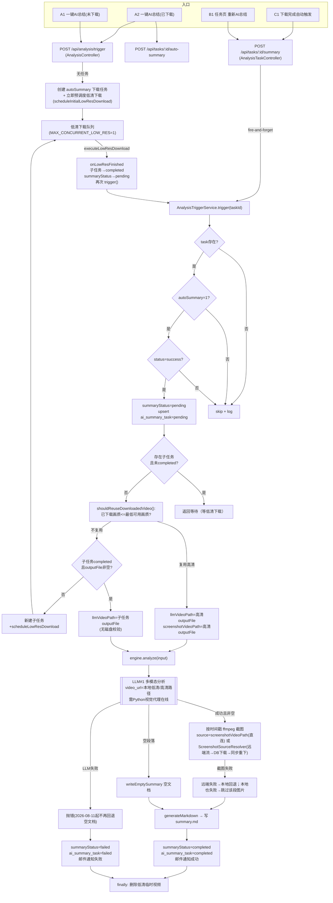

# AI 总结功能全路径分析与改进建议（2026-08-11）

## 1. 分析范围与方法

本文档系统性梳理 `AI 总结`（视频分析总结）功能的完整链路：所有用户操作入口、server 端编排流程、状态模型、以及"数据库记录 vs 磁盘真实状态"的一致性缺口。分析基于当前代码（commit `ce25e57` 工作区）。

涉及文件：

- `packages/server/src/analysis/analysis-trigger.service.ts`
- `packages/server/src/analysis/analysis-engine.ts`
- `packages/server/src/analysis/analysis.controller.ts`
- `packages/server/src/analysis/analysis-task.controller.ts`
- `packages/server/src/analysis/screenshot-source-resolver.ts`
- `packages/server/src/download/download-scheduler.ts`
- `packages/server/src/download/download.service.ts`
- `packages/server/src/database/database.service.ts`
- `packages/core/src/usecases/DownloadExecutionUseCase.ts`
- `packages/frontend/src/views/ParseResultList.vue` / `Downloading.vue` / `AiSummaryTasks.vue`
- `packages/frontend/src/api/index.ts`

## 2. 用户操作入口清单

| # | 入口（前端） | 后端端点 | 语义 |
|---|---|---|---|
| A1 | 解析结果页「一键 AI 总结」（未下载过） | `POST /api/analysis/trigger` | 以 bvid+cid 创建 autoSummary 下载任务，并**立即预调度低清下载** |
| A2 | 解析结果页「一键 AI 总结」（已下载） | `POST /api/tasks/:id/auto-summary` + `POST /api/analysis/trigger` | 开 autoSummary + 触发（fire-and-forget） |
| A3 | 解析结果页「AI 总结开关」 | `POST /api/tasks/:id/auto-summary` | 只开/关自动总结，不立即触发 |
| B1 | 下载任务页「立刻/重新 AI 总结」 | `POST /api/tasks/:id/summary` | 任务级触发（fire-and-forget） |
| C1 | 自动：任意下载任务完成后 | `download-scheduler.onAnalysisTrigger` | autoSummary=1 时自动 `trigger()` |
| D1 | AI 总结任务页（只读） | `GET /api/summary-tasks` | 列表展示 |
| E1 | 调试：`POST /api/analysis/run` | 手动绝对路径分析 | 绕过任务状态机，debug 用 |

## 3. 状态模型（三套并行状态）

```
task（任务级）
  ├─ status: created/downloading/success/failed/stopped
  ├─ summary_status / summary_output        ← 双写镜像
  └─ auto_summary, outputFile, outputPath

analysis_sub_task（任务级，task_id 外键）
  ├─ status: created → completed | failed
  └─ outputFile（低清视频路径）

ai_summary_task（资源级，UNIQUE(bvid,cid)）
  ├─ status: pending → analyzing → completed | failed
  ├─ summary_output, errorMessage, lastTriggeredAt, lastCompletedAt
  └─ source_task_id
```

读取时 `task.summaryStatus` 实际是 `COALESCE(ai_summary_task.status, task.summary_status)`
（`database.service.ts:228-229`），即资源级记录在任务列表上做展示覆盖。

## 4. 全路径流程图



## 5. 异常与缺口清单（重点：DB vs 磁盘）

### 5.1 磁盘状态从未被校验（核心问题）

| # | 场景 | 现状 | 后果 |
|---|---|---|---|
| G1 | 低清视频文件被手动删除后重新触发 | `trigger()` 直接复用子任务 `outputFile`（`analysis-trigger.service.ts:254`），无 `existsSync` | LLM 读不到文件 → 分析失败（此前是静默空文档，2026-08-11 起报错）；**不重新下载** |
| G2 | 高清 outputFile 被删除后触发 | `llmVideoPath=screenshotVideoPath=高清路径`，无磁盘校验 | 分析失败 / 截图为空；`ScreenshotSourceResolver` 的远端回退**永远不会走到**（因为 `screenshotVideoPath` 恒有值，`analysis-engine.ts:212-218` 直接短路） |
| G3 | 截图源回退到"已完成本地下载" | `findCompletedTaskByBvidAndCid` 只查 DB，`quality>=80`，无磁盘校验（`screenshot-source-resolver.ts:98-117`） | 引用了已删除的旧文件 → 截图为空 |
| G4 | `resolveTaskForAnalysis` 重载其它任务的 outputFile | 只看 DB 最新 completed 任务，无磁盘校验（`analysis-trigger.service.ts:415-447`） | 同上 |

> 根因：`NodeFileStore.exists()` 只在 `DownloadExecutionUseCase` 的"文件已存在跳过下载"处使用（`DownloadExecutionUseCase.ts:64`）。所有"复用已有视频资源"的判断都只看 DB。

### 5.2 状态机缺口

| # | 场景 | 现状 | 后果 |
|---|---|---|---|
| S1 | 服务重启时低清下载进行中/排队中 | 只把 `task.status=downloading` 标 failed（`download-scheduler.ts:56-64`）；`analysis_sub_task` 停在 `created`，低清队列是内存态全部丢失 | 重触发时 `lowResSubTask.status!==completed` → `trigger()` 一直 return 等待 → **永远卡在 pending，无任何补救** |
| S2 | `trigger()` 中 try 块之前抛错（`shouldReuseDownloadedVideo`、`resolveTaskForAnalysis`、`mkdir` 等） | 异常只被 controller/回调 log，`summaryStatus` 已置 pending（`analysis-trigger.service.ts:178-189`） | **用户看到"触发中"但状态永停 pending，无错误反馈**（fire-and-forget） |
| S3 | 同资源多任务并存 | 子任务按 `task_id` 归属，AI 总结按 `(bvid,cid)` 资源级 | 低清子任务与资源重载后的 outputFile 来源不一致，复用关系错位 |
| S4 | 资源级重复触发 | `POST /api/analysis/trigger` 只校验 `task.autoSummary`（`analysis.controller.ts:114-127`）；任务级 `POST /api/tasks/:id/summary` 校验了进行中状态（`analysis-task.controller.ts:47-52`） | 两入口守卫不一致；并发快速双点仍可能双跑（非原子读改写） |
| S5 | 低清下载失败重试 | `onLowResFinished` 失败 → 子任务标 failed + 任务 summaryStatus=failed；重触发会因 `.find(status!=='failed')` 找到空而新建子任务 | 可恢复，但无自动重试、无指数退避 |
| S6 | `ai_summary_task` 与 `task.summary_status` 双写 | `updateTaskStatus` 和 `upsertAiSummaryTask` 各写一份，读取靠 COALESCE 覆盖 | 状态漂移风险、展示与持久化不一致 |

### 5.3 其它

- `summaryDir` 用 `task.title` 拼路径：标题变化或重触发不同任务 → 产生孤儿目录。
- `AiSummaryTasks.vue` 仅展示 `summaryOutput`（md 路径），不提供打开/重下能力。
- 邮件通知 SMTP 未配置时静默跳过（有日志），无前端提示。

## 6. 改进建议

### 6.1 快速修复（P0，改动小、风险低）

1. **资源复用前做磁盘校验**：新增 `analysisAssetService.fileExists(path)`（包装 `fs.access`）。在以下位置校验，失败即视为"资源缺失"：
   - `trigger()` 复用低清子任务 outputFile 前（G1）
   - `trigger()` 复用高清 outputFile 前（G2）
   - `ScreenshotSourceResolver` 回退到 DB 下载文件前（G3）
2. **低清文件缺失 → 重新下载**：子任务 `completed` 但文件不存在时，将其置回 `created`（清空 outputFile）并重新 `scheduleLowResDownload`，而非直接报错。
3. **启动时子任务对账**：`onModuleInit` 中把状态为 `created`/`downloading` 的 `analysis_sub_task` 标为 `failed`（或重新入队低清下载），消除 S1 卡死。
4. **`trigger()` 全程 try 包裹**：把 S2 列出的前置步骤移入 try/catch，失败时统一落 `summaryStatus=failed` + `ai_summary_task=failed` + 通知，消除静默失败。
5. **入口守卫统一**：`POST /api/analysis/trigger` 增加资源级进行中冲突拦截（同 `analysis-task.controller.ts:47-52`），并把触发改为原子读改写（先查再置 analyzing）。

### 6.2 中期架构整理（P1）

- **引入 `AnalysisVideoResolver`（资产决策层）**：把"给定 bvid+cid，判定是否有可用视频（先查磁盘再查 DB），没有则下载"这一逻辑从 `trigger()` / `ScreenshotSourceResolver` / `DownloadExecutionUseCase` 三处收敛为一处，所有入口复用，磁盘与 DB 的仲裁逻辑单一化。
- **AI 总结状态单一来源**：资源级状态以 `ai_summary_task` 为准，`task.summary_status/summary_output` 降级为只读镜像（或删除双写），消除 S6。
- **子任务改为资源级键**：`analysis_sub_task` 从 `task_id` 改为 `(bvid,cid,quality)` 维度（或同时保留 task_id 作溯源），消除 S3 错位。

## 7. 是否重构架构的结论

**不需要推翻重写，但需要补一层"资产与状态对账"。**

理由：

- 模块边界（server 编排 / core 用例 / adapter 能力）是清晰的，`AnalysisEngine`、`DownloadScheduler`、`ScreenshotSourceResolver` 的职责划分基本合理；
- 问题集中在两点：**没有统一裁决"磁盘 vs DB"的资产层**，以及**三套并行状态模型之间缺少一致性约束**；
- 这两点通过"新增 `AnalysisVideoResolver` + 状态单一来源收敛 + 对账修复"即可解决，属于"补齐架构缺口"而非"重写"。

如果未来出现以下信号，才考虑重新设计：

- 需支持本地视频/非 B 站资源的上传分析（当前 `AnalysisInput.metadata.type` 已预留 local，但链路未真正打通）；
- AI 分析成为多阶段流水线（字幕解析/关键帧/多模型评审），需要正式的任务 DAG 与可恢复执行；
- 需要多实例横向扩展（当前低清队列与并发控制都是进程内存态，S1 会放大）。

## 8. 验证方式

- 现有：`pnpm typecheck`（零错误）。
- 建议补充：针对 G1/G2 的磁盘缺失场景的手工回归（`docs/testing/`），以及 S1 重启恢复的冒烟验证。
