# video1

## 内容总结

- 巧用廉价辅料打造独特风格: 通过更换帽子、腰链等几块钱的廉价辅料，可以将基础款三件套从日常风瞬间转变为度假风或异域风情（如新疆风）。博主强调利用现有衣物搭配便宜配饰，实现“花小钱办大事”，创造独一无二的个人风格。
- 基础款衣物+配饰提升旅游感: 利用衣柜里常见的基础款吊带和长裤，搭配具有民族风或设计感的腰封、臀巾等配饰，可以低成本打造出适合旅游拍照的造型，避免与他人撞衫。
- 多层项链的多功能用法: 展示了一款多层彩色珠子项链，不仅可以作为复古风格的颈饰，还可以作为腰链使用，甚至可以作为毛衣链，提高单品在旅途中的利用率。
- 一衣多穿：吊带变短裙/屁帘: 演示了将蕾丝吊带衫向下拉并塞入裤腰，将其改造为半身短裙或“屁帘”（外搭裙摆），增加穿搭的层次感和异域风情。
- 利用丝带改变裤型: 对于过长的阔腿裤，可以利用鞋子自带的丝带或额外购买的丝带在脚踝处捆绑，将阔腿裤变为流行的灯笼裤型，既解决了长度问题又增加了造型感。
- 开衫领型的微调技巧: 通过别针固定开衫领口并调整内搭项链的位置，可以改变领型，使整体造型更具中式韵味或氛围感，避免单调。
- 衬衫套装的风格转换: 同一套米白色衬衫套装，通过添加细腰带可变为日常通勤装；通过添加丝巾、宽腰封、靴子和礼帽，则可转换为帅气的马术风或老钱风旅游装。
- 高饱和度与夸张配饰出片法则: 针对基础简单的衣服，若想拍照出片，建议遵循三点：适当露肤、使用夸张配饰、小面积撞色。例如白色上衣搭配亮蓝色裤子和铆钉腰封。
- 抹胸裙的多重穿法: 展示了一件黑白格纹波点抹胸裙，既可以作为半身裙搭配T恤，也可以提上来作为抹胸上衣，还可以通过加腰带改变版型，打造酷帅或古早味风格。
- 绑带抹胸的多种系法: 演示了黄色波点绑带抹胸的多种穿法：胸前系蝴蝶结（韩系甜美）、绕至颈后系住（遮挡副乳、法式复古）、斜肩系法（设计感）以及单肩系法。
- 透视罩衫的叠穿技巧: 对于微透且无扣固定的交叉领罩衫，可以通过内搭蕾丝背心营造假两件效果，或将领口下拉露出内搭肩带，增加慵懒和层次感，适合旅游穿着。
- 半身裙变抹胸上衣: 将松紧腰的黄色格纹半身裙向上提拉作为抹胸上衣穿着，搭配牛仔裤和腰带收腰，打造明媚活泼的旅游造型。
- 可爱元素的呼应搭配: 通过卡通印花长袖T恤、猫耳牛仔帽、星星图案包包和鞋子的色彩与元素呼应，打造可爱俏皮的日常或旅游穿搭，并利用挂件增加细节趣味。
- 舒适套装的临时改造: 针对舒适的黑色透视三件套，若需临时拍照出片，可将背心下摆塞入内衣或用绑带在腰部打结，制造镂空效果，瞬间提升时尚度和个人风格。

## 重点内容

### 巧用廉价辅料打造独特风格

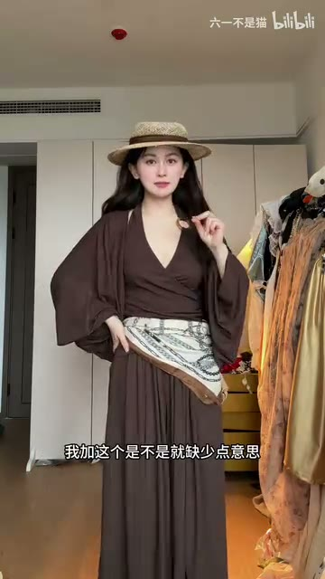

> 巧用廉价辅料打造独特风格

**相关原文：**
> 通过更换帽子、腰链等几块钱的廉价辅料，可以将基础款三件套从日常风瞬间转变为度假风或异域风情（如新疆风）。博主强调利用现有衣物搭配便宜配饰，实现“花小钱办大事”，创造独一无二的个人风格。

### 基础款衣物+配饰提升旅游感

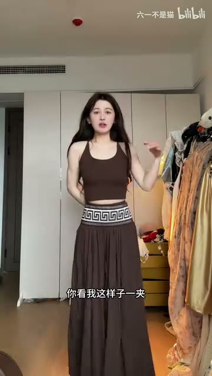

> 基础款衣物+配饰提升旅游感

**相关原文：**
> 利用衣柜里常见的基础款吊带和长裤，搭配具有民族风或设计感的腰封、臀巾等配饰，可以低成本打造出适合旅游拍照的造型，避免与他人撞衫。

### 多层项链的多功能用法

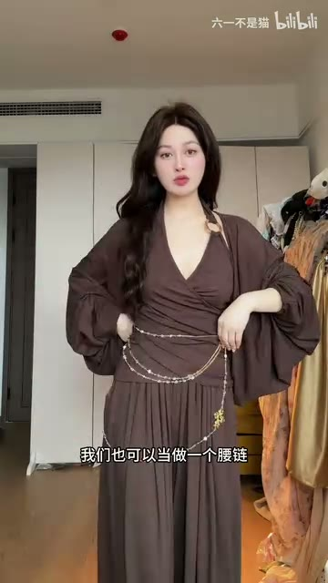

> 多层项链的多功能用法

**相关原文：**
> 展示了一款多层彩色珠子项链，不仅可以作为复古风格的颈饰，还可以作为腰链使用，甚至可以作为毛衣链，提高单品在旅途中的利用率。

### 一衣多穿：吊带变短裙/屁帘

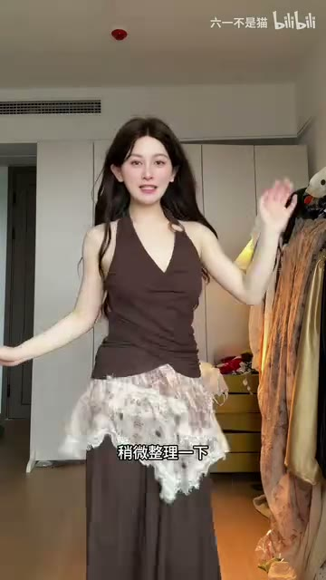

> 一衣多穿：吊带变短裙/屁帘

**相关原文：**
> 演示了将蕾丝吊带衫向下拉并塞入裤腰，将其改造为半身短裙或“屁帘”（外搭裙摆），增加穿搭的层次感和异域风情。

### 利用丝带改变裤型

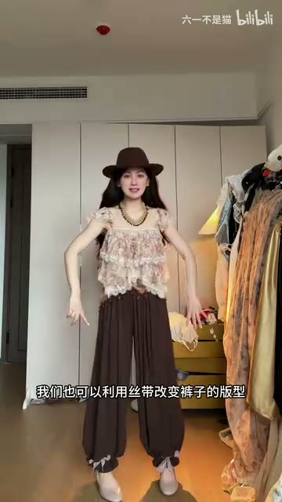

> 利用丝带改变裤型

**相关原文：**
> 对于过长的阔腿裤，可以利用鞋子自带的丝带或额外购买的丝带在脚踝处捆绑，将阔腿裤变为流行的灯笼裤型，既解决了长度问题又增加了造型感。

### 开衫领型的微调技巧

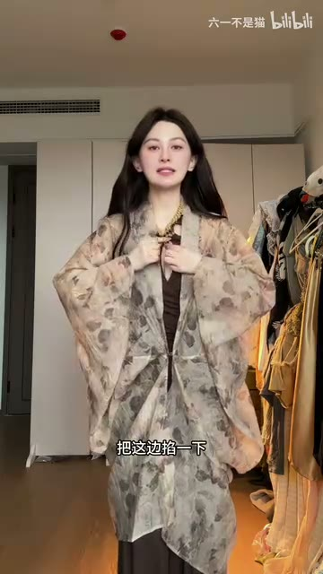

> 开衫领型的微调技巧

**相关原文：**
> 通过别针固定开衫领口并调整内搭项链的位置，可以改变领型，使整体造型更具中式韵味或氛围感，避免单调。

### 衬衫套装的风格转换

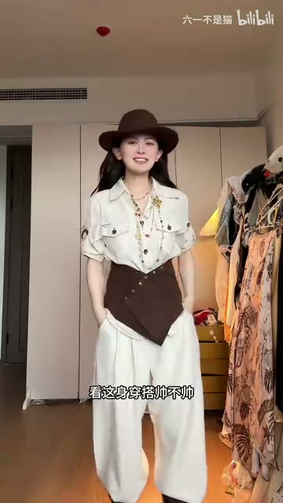

> 衬衫套装的风格转换

**相关原文：**
> 同一套米白色衬衫套装，通过添加细腰带可变为日常通勤装；通过添加丝巾、宽腰封、靴子和礼帽，则可转换为帅气的马术风或老钱风旅游装。

### 高饱和度与夸张配饰出片法则

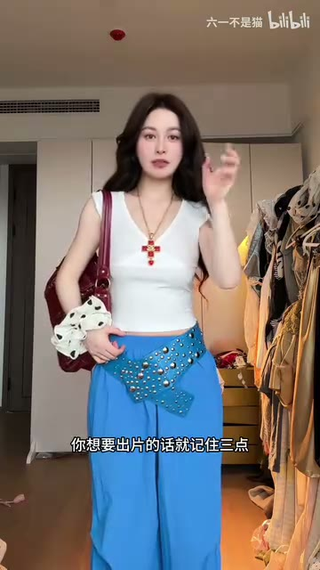

> 高饱和度与夸张配饰出片法则

**相关原文：**
> 针对基础简单的衣服，若想拍照出片，建议遵循三点：适当露肤、使用夸张配饰、小面积撞色。例如白色上衣搭配亮蓝色裤子和铆钉腰封。

### 抹胸裙的多重穿法

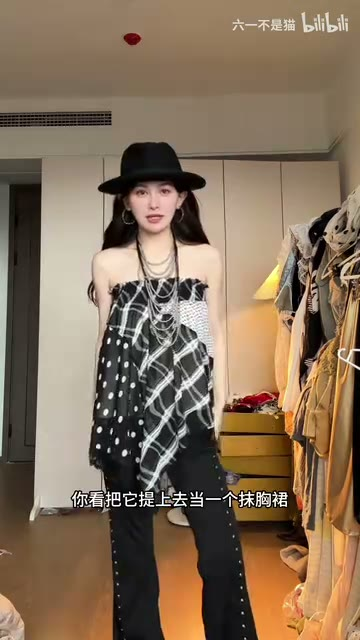

> 抹胸裙的多重穿法

**相关原文：**
> 展示了一件黑白格纹波点抹胸裙，既可以作为半身裙搭配T恤，也可以提上来作为抹胸上衣，还可以通过加腰带改变版型，打造酷帅或古早味风格。

### 绑带抹胸的多种系法

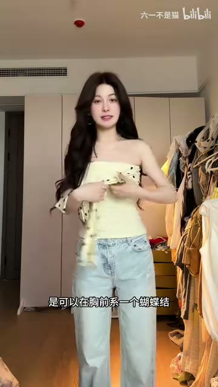

> 绑带抹胸的多种系法

**相关原文：**
> 演示了黄色波点绑带抹胸的多种穿法：胸前系蝴蝶结（韩系甜美）、绕至颈后系住（遮挡副乳、法式复古）、斜肩系法（设计感）以及单肩系法。

### 透视罩衫的叠穿技巧

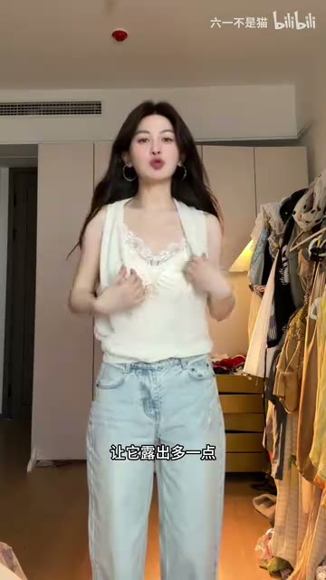

> 透视罩衫的叠穿技巧

**相关原文：**
> 对于微透且无扣固定的交叉领罩衫，可以通过内搭蕾丝背心营造假两件效果，或将领口下拉露出内搭肩带，增加慵懒和层次感，适合旅游穿着。

### 半身裙变抹胸上衣

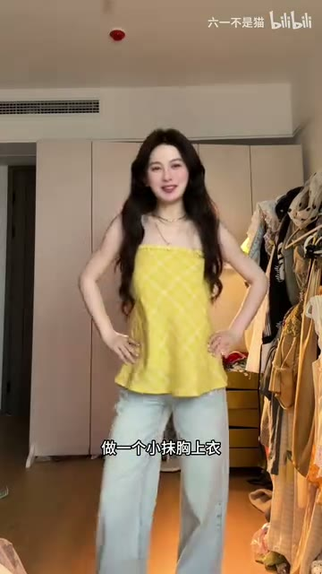

> 半身裙变抹胸上衣

**相关原文：**
> 将松紧腰的黄色格纹半身裙向上提拉作为抹胸上衣穿着，搭配牛仔裤和腰带收腰，打造明媚活泼的旅游造型。

### 可爱元素的呼应搭配

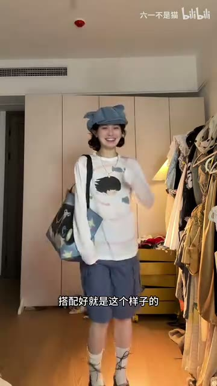

> 可爱元素的呼应搭配

**相关原文：**
> 通过卡通印花长袖T恤、猫耳牛仔帽、星星图案包包和鞋子的色彩与元素呼应，打造可爱俏皮的日常或旅游穿搭，并利用挂件增加细节趣味。

### 舒适套装的临时改造

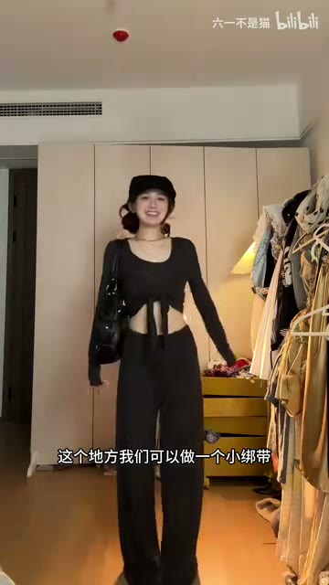

> 舒适套装的临时改造

**相关原文：**
> 针对舒适的黑色透视三件套，若需临时拍照出片，可将背心下摆塞入内衣或用绑带在腰部打结，制造镂空效果，瞬间提升时尚度和个人风格。
